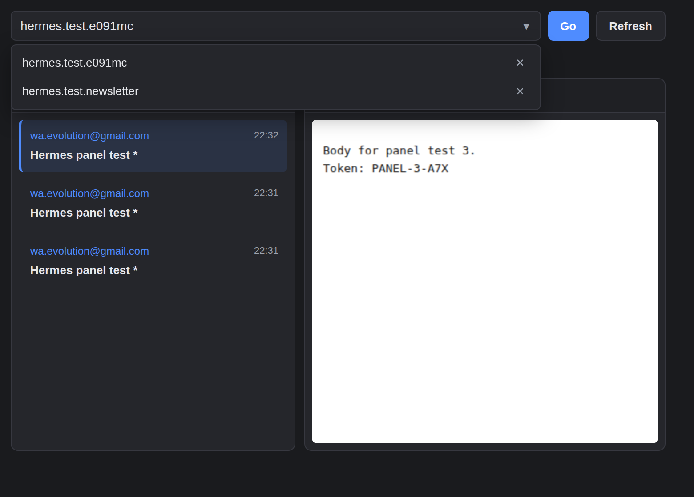

# YOPmail Checker

A minimal Manifest V3 Chrome extension to check the last few emails of any YOPmail inbox.



## Install

1. Open Chrome and go to `chrome://extensions`.
2. Enable **Developer mode** (toggle in the top-right corner).
3. Click **Load unpacked**.
4. Select this folder (the one containing `manifest.json`).
5. The YOPmail Checker icon should appear in your toolbar.

## Use

1. Click the extension icon.
2. Enter a YOPmail address (e.g. `hermes.test.e091mc` or `hermes.test.e091mc@yopmail.com`).
3. Click **Go**.
4. The left pane lists the last 3 emails; click one to read it in the right pane.
5. Click **Refresh** to reload the inbox.

### Saved addresses

- The last used address is stored under `yopmail_address` and restored when the popup opens.
- Every address you check is added to `yopmail_addresses` (newest first, capped at 25).
- Click the **▾** toggle to open the saved-addresses dropdown.
- Pick a row to load that inbox immediately.
- Click the **✕** on a row to remove that address from history.
- If you upgraded from an older version that only saved a single address, the first launch migrates that value into the new history list automatically.

## Files

- `manifest.json` — MV3 manifest.
- `popup.html`, `popup.css`, `popup.js` — popup UI and logic.
- `background.js` — minimal service worker.
- `icon16.png`, `icon48.png`, `icon128.png` — extension icons.
- `scripts/test-fetch.mjs` — Node test script for the YOPmail HTTP pipeline.
- `notes/` — coordination briefs (not shipped in the zip).

## Test

```bash
node scripts/test-fetch.mjs
```

This prints the parsed last-3 list and the plain-text body of the newest message for the live inbox `hermes.test.e091mc@yopmail.com`.

## Testing / dev

The popup supports a `?address=` query parameter for headless testing and automation:

```bash
chromium --headless=new --load-extension=/path/to/yopmail-chrome-ext \
  --user-data-dir=/tmp/yp-profile --dump-dom \
  "chrome-extension://<extension-id>/popup.html?address=hermes.test.e091mc@yopmail.com"
```

When `?address=` is present, the popup prefills and saves that address and immediately loads the inbox without requiring a click.

## Zip

`yopmail-checker.zip` is a packaged copy of the extension for easy sharing. It excludes `notes/`, `node_modules/`, `screenshot-popup.png`, and the zip itself.
